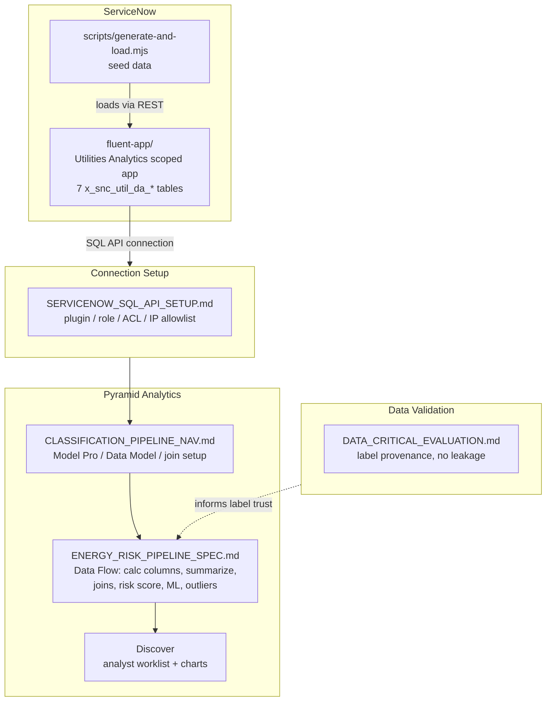

# Energy Utilities Risk Pipeline

ServiceNow scoped app (`x_snc_util_da_*`) + seed data generator, plus the Pyramid Data Flow spec for the hardship/tamper risk-scoring pipeline built on top of it.

## Overview



## Contents

- [`fluent-app/`](fluent-app/) — the ServiceNow Fluent scoped app (`Utilities Analytics`, scope `x_snc_util_da`). Defines the 7 tables (`customer`, `property`, `nmi`, `usage`, `billing`, `meter_read`, `solar_export`) and the import sets used to load seed data.
- [`fluent-app/scripts/generate-and-load.mjs`](fluent-app/scripts/generate-and-load.mjs) — generates synthetic seed data (500 NMIs, 12 named personas + 486 synthetic customers, 24 months of usage/billing/meter-read history) with real causal patterns behind `hardship_flag`/`tamper_flag`, and loads it into the ServiceNow instance via REST.
- [`fluent-app/scripts/purge-table.mjs`](fluent-app/scripts/purge-table.mjs) — bulk-deletes all rows from a given table on the target instance, useful for re-running the seed generator from a clean state.
- [`docs/ENERGY_RISK_PIPELINE_SPEC.md`](docs/ENERGY_RISK_PIPELINE_SPEC.md) — the full Pyramid Model Pro / Data Flow build spec: Stage 1-7 (row-level flags, summarize, joins, deterministic risk score, ML classification, outlier detection, Discover worklist/charts), plus a Gotchas section from actually building it.
- [`docs/CLASSIFICATION_PIPELINE_NAV.md`](docs/CLASSIFICATION_PIPELINE_NAV.md) — Pyramid Studio navigation baseline (Data Model relationships, join types, ML node paths, JDBC rate-limit gotcha) confirmed against Pyramid's own docs.
- [`docs/DATA_CRITICAL_EVALUATION.md`](docs/DATA_CRITICAL_EVALUATION.md) — why this dataset supports real supervised classification (volume, label provenance, no leakage).
- [`docs/SERVICENOW_SQL_API_SETUP.md`](docs/SERVICENOW_SQL_API_SETUP.md) — plugin/role/ACL/IP-allowlist steps if the Pyramid connection fails to reach the SQL API.

## Prerequisites

- ServiceNow instance with [RaptorDB Pro](https://store.servicenow.com/store/app/699af7c347404f90040ae738436d4350#linksAndDocuments) installed.
- A Pyramid Analytics instance (Model Pro + Data Flow + Discover), connected to the ServiceNow instance above.

## Setup

1. `cp .env.example .env` at the repo root, fill in `SN_UTIL_SRC_URL` / `SN_UTIL_SRC_USER` / `SN_UTIL_SRC_PASS` for your ServiceNow instance.
2. Install the ServiceNow SDK CLI (`@servicenow/sdk`, already in `fluent-app/package.json` devDependencies):
   ```
   cd fluent-app
   npm install
   ```
3. Deploy the scoped app to your instance:
   ```
   npm run deploy
   ```
4. Seed data:
   ```
   node scripts/generate-and-load.mjs
   ```
   Set `DRY_RUN=1` to print sample rows without loading. Set `RESUME_FROM=<customer|property|nmi|usage|billing|meter_read|solar_export>` to resume a partial load.
5. To wipe a table and re-seed: `node scripts/purge-table.mjs <table_name>`.

## Create the Pyramid ↔ ServiceNow Connection

Do this once in Pyramid, before opening Model Pro:

1. In ServiceNow, create a dedicated service account for Pyramid, e.g. `pyramid_svc`, with read access to the `x_snc_util_da_*` tables and RaptorDB's SQL API role.
2. In Pyramid: **Content Explorer** → **New** → **Data Sources** → **ServiceNow**.
3. Connection type: **ODBC Direct / SQL API** (600 req/hour limit on JDBC REST, see `docs/CLASSIFICATION_PIPELINE_NAV.md`).
4. Server/URL: your instance URL (`SN_UTIL_SRC_URL`). Auth: the `pyramid_svc` account.
5. Test the connection, select the 7 `x_snc_util_da_*` tables (`customer`, `property`, `nmi`, `usage`, `billing`, `meter_read`, `solar_export`).
6. Save the data source, build a Model Pro model on top of it.
7. Follow `docs/ENERGY_RISK_PIPELINE_SPEC.md` to build the Data Flow, train the classifiers, and build the Discover worklist.

If the connection fails at step 5, see `docs/SERVICENOW_SQL_API_SETUP.md` for plugin/role/ACL/IP-allowlist checks.

## Notes

- The Pyramid flow uses native Data Flow/ML nodes, no Scripting nodes.
- The seed generator embeds real causal signal behind `hardship_flag`/`tamper_flag`. See `docs/DATA_CRITICAL_EVALUATION.md` for the generation logic.
